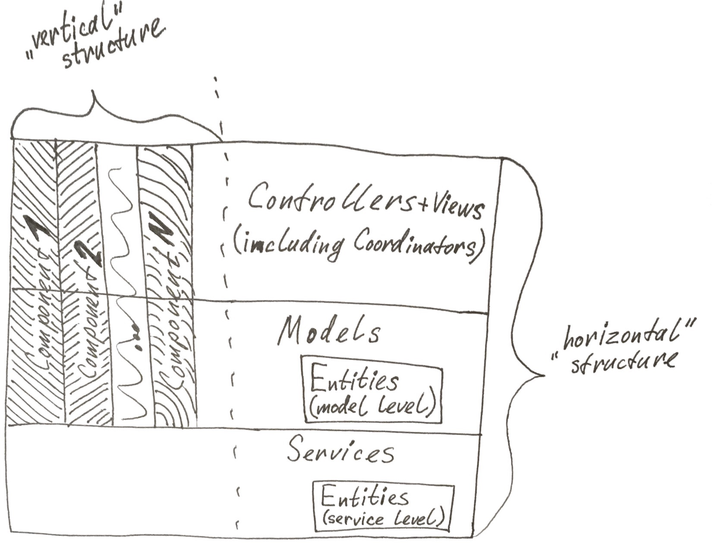

# THE TASK

The goal of this test is to develop a native iOS “weather” application which shows the user’s location on an interactive map with the current weather.

Users should be able to double tap on any location on the map and see the current weather based on the selected coordinates.

Any free weather data provider can be used to supply the weather information (e.g. OpenWeatherMap API).

The app should consist of two screens:
1) The main screen that displays the map with current location
2) A second screen which will be opened when the user double taps on a location, which will display the current weather information for the selected location.

Optional: the app should work in offline mode, to display the cached weather information for previously selected location.

# ARCHITECTURE/APPROACH

When it comes to architecture, I use "Clean Architecture" approach, but NOT directly (which is visualized in circles and was done for web development, as far as I remember), but more like inspiration. The main idea is to have your types separated into layers and each layer relies (depends on) the closest lower layer only, can't depend on a type from a higher level or a type from 2 layers deep in hierarchy.

I start with MVC in mind. 'View' and 'Controller' are basically working the same as usually in MVC, but I also tend to consider 'View' and 'Controller' more as a whole thing (like in MVVM), so View is more like "inside" Controller (more on that later).

I also use 'Flow Controller'/'Coordinator' design pattern, but, again, as inspiration, not directly. That means such coordinator is nothing more than a special Controller that has responsibility to control presentation logic of it's nested/child controllers. For example, typical pretendent for coordinater is UINavigationController subclass. A special kind of coordinator controller is presented in each app — it's the class marked as '@UIApplicationMain' and called 'AppDelaget' by default. It's actually a special kind of controller (it's 'window' acts as the 'view' acts for regular UIViewController-based controller type), and it's a coordinator at the same time, because it's responsible for initialization of 'window.rootViewController' and presentation of the 'window' (when not using storyboards).

The Model part of the MVC pattern represents app logic (that includes both business rules and app rules). Think of each model layer type as a 'Feature' of the app. Each Model can be in one particular state at a time. Eash state can (optionally) have one or sevaral associated values. This is why Models are implemented as enums with associated values.

Then you also can have Service kind of types. Service is (usually) a class (can have internal state and is a reference type). What's special about Service is that its internal state does not change over time, it's more like config. And then service can provide whatever functionality it is made for using that internal configuration via instance (and type) level functions. A perfect example of service is API wrapper that holds an auth key and base URL path for all requests, allowing later send request to particular API endpoint by just passing relative path and (optionally) parameters and get response our of this when it's ready. Services are recommended to provide synchronous API, so that flow multithreading flow control can be done on a higher level.

Last special kind of types are Entity types. Entity is basically a dumb data storage, so it's best represented by a struct in Swift. It should not be a refence type and should not have any functionality at all. It can be used in memory only or be persistable (via special service) to any storage — local or remote. Entities can be on both Service and Model layer. Note, that if try to compare with MVVM — entities on service layer are similar to M layer data objects and are specific to how service of origin represents the data, while entities on model layer are similar to VM data objects and are specific to how destination model (and corresponding controller+view) need the data to be represented.

# DEPENDENCY GRAPH (see picture)

Service is the lowest layer in hierarchy, it can use (depend on) other services (and their entities), but know nothing about higher level types (none of the MVC).

Model layer types can use (depend on) other model types as well as use services to implement necessary functionality.

Controller layer types can use (depend on) other controller types as well as use model layer types to implement necessary app logic (BUT can NOT use services directly). Controller layer types can ALSO use (depend on) types from View layer.

View layer types should not depend on any other layers and should only be limited to display logic implementation and provide any outgoing signals (as result of user on-screen interactions) in form of callbacks of any sorts (closures or target-selector pairs, etc.), which should be utilized by corresponding controller and then interpreted accordingly into appropriate call to action on model layer.

# OTHER NOTES

ALSO I use notion of 'Component' to give project some kind of "vertical" structure (across MVC+Serivce layers which are considered to be "horizontal" strucutre). Each component aggregates related models, controllers and views. Services usually stand indepenently. Entities may be on a higher level (shared, the ones supposed to be reused across different models/features and hard to bind with any specific feature) or belong to a particular model/service.

I tend to use the model layer types as scope, to represent corresponding component. With typealiases, I declare related (sub)models, controllers and views as nested types, while actually implement them as top level classes (because Xcode breaks autocompletion in many cases when inside a nested Swift type, so I have to use this slightly ugly life hack).

Among other techniques, I use nested types and proxy design pattern as a way to separate differnt parts of source code into scopes inside global app scope and then access nested members via "dot" syntax. It not only inspires you to see more clearly what's general/shared and what's more specific, but also makes your code more concice. Especially keeping in mind you mostly use same scope members within the scope itself, so you can use short names without full prefix and without having name conflicts with similar members from another scope. Nested types (scopes) also give better idea about overall code/project structure, which is always an advantage, especially in big codebases.